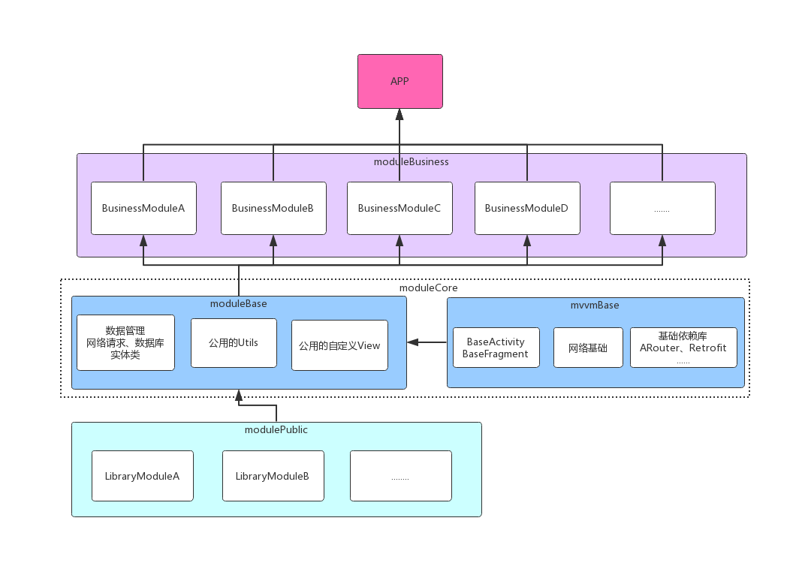

## MVVM模块化开发 架构

#### 项目结构

```
|-app						//项目主模块
|	|--libs
|	|--src
|-moduleBusiness			//逻辑业务模块
|	|--usermodule			//不同模块用不同的module分开开发
|	|-- ...
|-moduleCore				//核心模块
|	|--modulebase			//针对项目的基础公共module，一些公共的配置，变量
|	|--mvvmbase				//架构的核心module
|-modulePublic				//第三方库模块
|	|--easyPopup
|	|--x5webview
|	|-- ...
|-build.gradle
|-config_common.gradle				//基础配置文件
|-config_module.gradle              //项目配置文件
|-settings.gradle
|-README.md
```

       